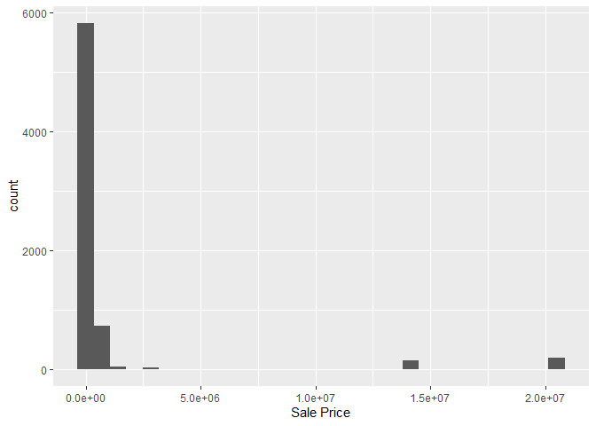
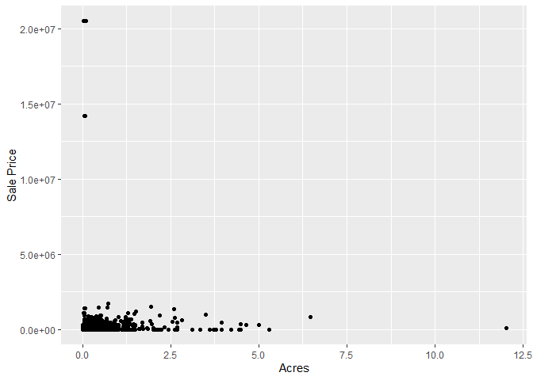
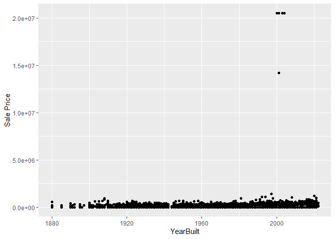

<!-- README.md is generated from README.Rmd. Please edit the README.Rmd file -->

# Lab report \#1

Follow the instructions posted at
<https://ds202-at-isu.github.io/labs.html> for the lab assignment. The
work is meant to be finished during the lab time, but you have time
until Monday evening to polish things.

Include your answers in this document (Rmd file). Make sure that it
knits properly (into the md file). Upload both the Rmd and the md file
to your repository.

All submissions to the github repo will be automatically uploaded for
grading once the due date is passed. Submit a link to your repository on
Canvas (only one submission per team) to signal to the instructors that
you are done with your submission.

inspect the first few lines of the data set:

what variables are there? of what type are the variables? what does each
variable mean? what do we expect their data range to be? is there a
variable of special interest or focus?

Since this is on housing sales, sale price is likely a variable of
interest.

16 variables, mainly quantitative. Parcel ID \#Used to answer required
questions \#summary(ames\[“Parcel ID”\]) character with ID. Type:
Character Length: 6935 (No Range values)

Address property address in Ames, IA. \#Used to answer required
questions \#summary(ames\[“Parcel ID”\]) Type: character Length: 6935
(No Range values)

Style factor variable detailing the type of housing. \#Used to Answer
required questions \#summary(ames\[’Style”\]) Type: character 1 Story
Frame: 3732 2 Story Frame: 1456 1 1/2 Story Frame: 711 Split Level
Frame: 215 Split Foyer Frame: 156 Other: 218 NA: 447

Occupancy factor variable of type of housing. Type:Character \#Used to
answer required question \#summary(ames\[“Occupancy”\]) Condominium: 711
Single-Family/Owner occupied: 4711 Townhouse: 745 Two-Family Conversion:
139 NA’s: 447

<<<<<<< HEAD
Sale Date date of sale. Type: Date library(classdata) ames
range(ames\$‘Sale Date’)
=======
Sale Date date of sale.
>>>>>>> d00481fd60bef5414983c23277405ff86947d3e8

Sale Price sales price (in US dollar). Type: Intger Data range is 0 -
20,500,000.

``` r
library(tidyverse)
```

    ## ── Attaching core tidyverse packages ──────────────────────── tidyverse 2.0.0 ──
    ## ✔ dplyr     1.1.4     ✔ readr     2.1.5
    ## ✔ forcats   1.0.0     ✔ stringr   1.5.1
    ## ✔ ggplot2   3.4.4     ✔ tibble    3.2.1
    ## ✔ lubridate 1.9.3     ✔ tidyr     1.3.0
    ## ✔ purrr     1.0.2     
    ## ── Conflicts ────────────────────────────────────────── tidyverse_conflicts() ──
    ## ✖ dplyr::filter() masks stats::filter()
    ## ✖ dplyr::lag()    masks stats::lag()
    ## ℹ Use the conflicted package (<http://conflicted.r-lib.org/>) to force all conflicts to become errors

``` r
library(classdata)
str(ames)
```

    ## tibble [6,935 × 16] (S3: tbl_df/tbl/data.frame)
    ##  $ Parcel ID            : chr [1:6935] "0903202160" "0907428215" "0909428070" "0923203160" ...
    ##  $ Address              : chr [1:6935] "1024 RIDGEWOOD AVE, AMES" "4503 TWAIN CIR UNIT 105, AMES" "2030 MCCARTHY RD, AMES" "3404 EMERALD DR, AMES" ...
    ##  $ Style                : Factor w/ 12 levels "1 1/2 Story Brick",..: 2 5 5 5 NA 9 5 5 5 5 ...
    ##  $ Occupancy            : Factor w/ 5 levels "Condominium",..: 2 1 2 3 NA 2 2 1 2 2 ...
    ##  $ Sale Date            : Date[1:6935], format: "2022-08-12" "2022-08-04" ...
    ##  $ Sale Price           : num [1:6935] 181900 127100 0 245000 449664 ...
    ##  $ Multi Sale           : chr [1:6935] NA NA NA NA ...
    ##  $ YearBuilt            : num [1:6935] 1940 2006 1951 1997 NA ...
    ##  $ Acres                : num [1:6935] 0.109 0.027 0.321 0.103 0.287 0.494 0.172 0.023 0.285 0.172 ...
    ##  $ TotalLivingArea (sf) : num [1:6935] 1030 771 1456 1289 NA ...
    ##  $ Bedrooms             : num [1:6935] 2 1 3 4 NA 4 5 1 3 4 ...
    ##  $ FinishedBsmtArea (sf): num [1:6935] NA NA 1261 890 NA ...
    ##  $ LotArea(sf)          : num [1:6935] 4740 1181 14000 4500 12493 ...
    ##  $ AC                   : chr [1:6935] "Yes" "Yes" "Yes" "Yes" ...
    ##  $ FirePlace            : chr [1:6935] "Yes" "No" "No" "No" ...
    ##  $ Neighborhood         : Factor w/ 42 levels "(0) None","(13) Apts: Campus",..: 15 40 19 18 6 24 14 40 13 23 ...

``` r
ames_maxprice <-ames$`Sale Price`
max(ames_maxprice, na.rm = TRUE)
```

    ## [1] 20500000

Multi Sale logical value: was this sale part of a package? Type: String
data only implys a Y or NA answer

YearBuilt integer value: year in which the house was built. Type: Intger
data ranges from 0 - 2022

``` r
ames_maxyear <-ames$`YearBuilt`
max(ames_maxyear, na.rm = TRUE)
```

    ## [1] 2022

``` r
min(ames_maxyear, na.rm = TRUE)
```

    ## [1] 0

Acres acres of the lot.

TotalLivingArea (sf) total living area in square feet.

Bedrooms number of bedrooms.

FinishedBsmtArea (sf) total area of the finished basement in square
feet.

LotArea(sf) total lot area in square feet. Quantitative- Range is
between zero and 523228.

AC logical value: does the property have an AC? Expected- Yes or no,
range- binary

FirePlace logical value: does the property have an fireplace? Expected
yes or not, range- it is binary

Neighborhood factor variable - levels indicate neighborhood area in
Ames. Not continuous, contains the specific neighborhood codes for the
house sold range- These are descrete values even though they are numbers

3.  start the exploration with the main variable:

what is the range of the variable? draw a histogram for a numeric
variable or a bar chart, if the variable is categorical. what is the
general pattern? is there anything odd? follow-up on oddities: see 4

``` r
library(classdata)
library(ggplot2)

ames
```

    ## # A tibble: 6,935 × 16
    ##    `Parcel ID` Address     Style Occupancy `Sale Date` `Sale Price` `Multi Sale`
    ##    <chr>       <chr>       <fct> <fct>     <date>             <dbl> <chr>       
    ##  1 0903202160  1024 RIDGE… 1 1/… Single-F… 2022-08-12        181900 <NA>        
    ##  2 0907428215  4503 TWAIN… 1 St… Condomin… 2022-08-04        127100 <NA>        
    ##  3 0909428070  2030 MCCAR… 1 St… Single-F… 2022-08-15             0 <NA>        
    ##  4 0923203160  3404 EMERA… 1 St… Townhouse 2022-08-09        245000 <NA>        
    ##  5 0520440010  4507 EVERE… <NA>  <NA>      2022-08-03        449664 <NA>        
    ##  6 0907275030  4512 HEMIN… 2 St… Single-F… 2022-08-16        368000 <NA>        
    ##  7 0535105180  511 25TH S… 1 St… Single-F… 2022-08-03             0 <NA>        
    ##  8 0907428446  4510 TWAIN… 1 St… Condomin… 2022-08-16        110000 <NA>        
    ##  9 0527301030  3409 EISEN… 1 St… Single-F… 2022-08-08        350000 <NA>        
    ## 10 0531363050  5426 KANSA… 1 St… Single-F… 2022-08-03        242000 <NA>        
    ## # ℹ 6,925 more rows
    ## # ℹ 9 more variables: YearBuilt <dbl>, Acres <dbl>,
    ## #   `TotalLivingArea (sf)` <dbl>, Bedrooms <dbl>,
    ## #   `FinishedBsmtArea (sf)` <dbl>, `LotArea(sf)` <dbl>, AC <chr>,
    ## #   FirePlace <chr>, Neighborhood <fct>

``` r
range(ames$`Sale Price`)
```

    ## [1]        0 20500000

``` r
ggplot(ames,
       aes(x = `Sale Price`)) +
  geom_histogram()
```

    ## `stat_bin()` using `bins = 30`. Pick better value with `binwidth`.

<!-- --> Most houses
are on the lower end of the range, with a couple outliers in the upper
millions. The data is skewed right and unimodal. This makes sense since
there is an expected bottom to housing prices but mansions and large
estates are expected to break the general trend when compared to average
suburban housing. Several houses also have a sale price of zero, which
may be an entry error.

\<\<\<\<\<\<\< HEAD what is the range of that variable? plot. describe
the pattern. what is the relationship to the main variable? plot a
scatterplot, boxplot or facetted barcharts (dependening on the types of
variables involved). Describe overall pattern, does this variable
describe any oddities discovered in 3? Identify/follow-up on any
oddities

======= 4. pick a variable that might be related to the main variable.
what is the range of that variable? plot. describe the pattern. what is
the relationship to the main variable? plot a scatterplot, boxplot or
facetted barcharts (dependening on the types of variables involved).
Describe overall pattern, does this variable describe any oddities
discovered in 3? Identify/follow-up on any oddities.

4.  Cameron Kraklio- Square feet compared to sale price

``` r
library(classdata)
library(ggplot2)

ames
```

    ## # A tibble: 6,935 × 16
    ##    `Parcel ID` Address     Style Occupancy `Sale Date` `Sale Price` `Multi Sale`
    ##    <chr>       <chr>       <fct> <fct>     <date>             <dbl> <chr>       
    ##  1 0903202160  1024 RIDGE… 1 1/… Single-F… 2022-08-12        181900 <NA>        
    ##  2 0907428215  4503 TWAIN… 1 St… Condomin… 2022-08-04        127100 <NA>        
    ##  3 0909428070  2030 MCCAR… 1 St… Single-F… 2022-08-15             0 <NA>        
    ##  4 0923203160  3404 EMERA… 1 St… Townhouse 2022-08-09        245000 <NA>        
    ##  5 0520440010  4507 EVERE… <NA>  <NA>      2022-08-03        449664 <NA>        
    ##  6 0907275030  4512 HEMIN… 2 St… Single-F… 2022-08-16        368000 <NA>        
    ##  7 0535105180  511 25TH S… 1 St… Single-F… 2022-08-03             0 <NA>        
    ##  8 0907428446  4510 TWAIN… 1 St… Condomin… 2022-08-16        110000 <NA>        
    ##  9 0527301030  3409 EISEN… 1 St… Single-F… 2022-08-08        350000 <NA>        
    ## 10 0531363050  5426 KANSA… 1 St… Single-F… 2022-08-03        242000 <NA>        
    ## # ℹ 6,925 more rows
    ## # ℹ 9 more variables: YearBuilt <dbl>, Acres <dbl>,
    ## #   `TotalLivingArea (sf)` <dbl>, Bedrooms <dbl>,
    ## #   `FinishedBsmtArea (sf)` <dbl>, `LotArea(sf)` <dbl>, AC <chr>,
    ## #   FirePlace <chr>, Neighborhood <fct>

``` r
range(ames$`TotalLivingArea (sf)`)
```

    ## [1] NA NA

``` r
ggplot(ames,
       aes(x = `TotalLivingArea (sf)`, y = `Sale Price`)) +
  geom_point()
```

    ## Warning: Removed 447 rows containing missing values (`geom_point()`).

<!-- --> It is a
linear positive relationship. There are several outliers with small
living areas but high prices. This could be due to a high lot area (like
a farm house). This helps to explain the outliers that we saw earlier as
<<<<<<< HEAD
they both have high sale price. \>\>\>\>\>\>\>
83f1f5dfa056d933dd76c0906bf671ba7b371cd8
=======
they both have high sale price.

Olivia Riniker - YearBuilt compares to the sale Price

``` r
library(classdata)
library(ggplot2)

range(ames$`YearBuilt`)
```

    ## [1] NA NA

``` r
# restrictnig data so it is more readable 
ames_filtered <- ames %>%
  filter(YearBuilt > 1879 )
ggplot(ames_filtered, aes(x = `YearBuilt`, y = `Sale Price`)) + geom_point()
```

<!-- -->

The Data has a linearly positive relationship. There are outliers that
were indicating a house built in the year 0 so logically i removed them
from the data being analysed. The outliers that you can see in the
scatter plot I believe indicate mansions that were built in the early
2000 due to the high listing prices around 20 million dollars.

``` r
remotes::install_github("heike/classdata")
```

    ## Skipping install of 'classdata' from a github remote, the SHA1 (1faa8961) has not changed since last install.
    ##   Use `force = TRUE` to force installation

``` r
library(classdata)
data("ames")
ames_data <- ames
```
>>>>>>> d00481fd60bef5414983c23277405ff86947d3e8
